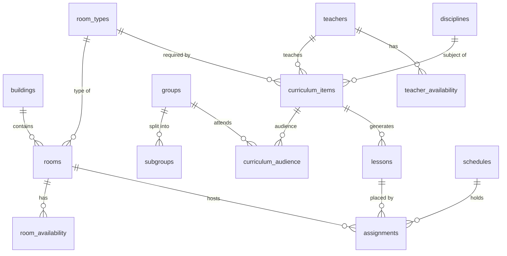

# Database schema

Migrations live in `backend/internal/store/migrations`. They are embedded into the binary and
applied at startup by goose when `DATABASE_URL` is set. Queries live in
`backend/internal/store/queries`. `make sqlc` (or `sqlc generate` in `backend/`) regenerates the
typed Go code in `internal/store/db`.

| Table | Purpose |
|---|---|
| `time_grid` | single row: days per week and periods (pairs) per day ([ADR-0001](adr-0001-time-and-audience-model.md)) |
| `periods` | start and end time of each pair |
| `buildings`, `room_types`, `rooms` | room fund: type and capacity feed H5/H6, building feeds the building-transition criterion |
| `groups`, `subgroups` | groups and their splits (`division`, `part`) |
| `teachers`, `disciplines` | reference data |
| `teacher_availability`, `room_availability` | exceptions per slot: `unavailable` (H4), `undesired` / `preferred` (soft 3.10). A missing row means available |
| `curriculum_items` | who teaches what, which room type, `weekly_count` + `biweekly_count` lessons per week |
| `curriculum_audience` | whole groups (`division = ''`), subgroups, or several groups (a stream) |
| `lessons` | schedulable units generated from curriculum items; `biweekly` lessons take an `odd`/`even` slot |
| `schedules` | a named set of assignments: solver result, working copy, published version |
| `assignments` | lesson → (day, period, parity) → room, plus the `pinned` flag |

Integration tests need `TEST_DATABASE_URL` (a server where the user may create databases). Each
test gets a fresh migrated database from `internal/store/storetest`.
