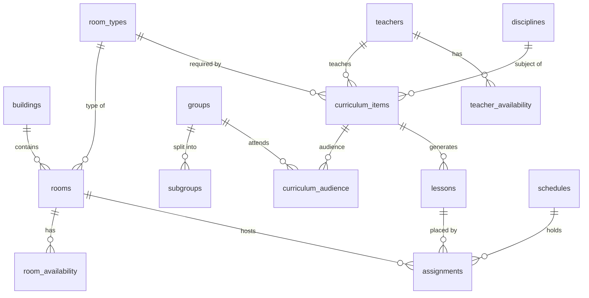

# Database schema

Migrations live in `backend/internal/store/migrations`. They are embedded into the binary and
applied at startup by goose when `DATABASE_URL` is set. Queries live in
`backend/internal/store/queries`. `make sqlc` (or `sqlc generate` in `backend/`) regenerates the
typed Go code in `internal/store/db`.

| Table | Purpose |
|---|---|
| `time_grid` | single row: days per week and periods (pairs) per day ([ADR-0001](adr-0001-time-and-audience-model.md)) |
| `periods` | start and end time of each pair |
| `buildings`, `room_types`, `rooms` | room fund: type and capacity feed H5/H6, building feeds the building-transition criterion |
| `groups`, `subgroups` | groups and their splits (`division`, `part`) |
| `teachers`, `disciplines` | reference data |
| `teacher_availability`, `room_availability` | exceptions per slot: `unavailable` (H4), `undesired` / `preferred` (soft 3.10). A missing row means available |
| `curriculum_items` | who teaches what, which room type, `weekly_count` + `biweekly_count` lessons per week |
| `curriculum_audience` | whole groups (`division = ''`), subgroups, or several groups (a stream) |
| `lessons` | schedulable units generated from curriculum items; `biweekly` lessons take an `odd`/`even` slot |
| `schedules` | a named set of assignments: solver result, working copy, published version |
| `assignments` | lesson → (day, period, parity) → room, plus the `pinned` flag |

Integration tests need `TEST_DATABASE_URL` (a server where the user may create databases). Each
test gets a fresh migrated database from `internal/store/storetest`.

## Double-booking protection (H1–H3)

The database itself refuses to store a double booking (arch §7), even if application code has a bug.

- `assignments.cells` is a generated `int4range` of occupancy cells
  `(day * 16 + period - 1) * 2 + week`. Week 0 is odd and week 1 is even. An `every` slot covers both
  weeks, so ranges overlap exactly when two lessons meet in at least one week.
- `assignments.teacher_id` is filled by a trigger from the lesson's curriculum item. The trigger
  also checks that the slot parity matches the lesson: a weekly lesson gets `every`, a biweekly one gets `odd`/`even`.
- `assignments_teacher_no_overlap` and `assignments_room_no_overlap` are GiST EXCLUDE constraints on
  `(schedule_id, teacher_id | room_id, cells)`.
- `assignment_audience` holds one row per assignment and audience member. Triggers keep it in sync
  with `assignments` and `curriculum_audience`. `assignments_group_no_overlap` excludes rows with the
  same `(schedule_id, group_id)`, overlapping `cells` and overlapping `box`. `box` is a point or
  slab in an 8-dimensional `cube`:
  - a whole group spans every dimension;
  - part *p* of the group's *k*-th division is fixed to *p* on dimension *k*.

  Parallel subgroups of one division are therefore disjoint, while different divisions always
  intersect (ADR-0001). Division indices are allocated once per group in `group_divisions` and are
  never renumbered.
- Violations surface as SQLSTATE `23P01` / `23514`. `store.MapError` maps them to
  `ErrTeacherBusy`, `ErrGroupBusy`, `ErrRoomBusy` and `ErrParityMismatch`.
